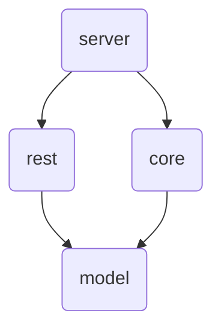

# goworker
A simple background worker for data orchestration and task handling in golang.

## TODO
- [ ] Write out one task, one routine, and one sensor
- [ ] Trigger a task via a http request
- [ ] Trigger a routine via a cron string schedule
- [ ] Trigger a sensor with a file change
- [ ] Put a file on disk
- [ ] Pull a file from disk

## Architecture
```
.
├── main.go
├── internal/
│   ├── core/
│   └── rest/
│   ├── model/
├── go.mod
└── go.sum
```

The  main.go file is the base of the project and will only import internal and will not import any other files.

The `interal/core` folder holds tasks, routines, and sensors. These will import the models in `internal/core` .

The `interal/rest` folder holds the handler methods for any http functionality and any data local to those operations. They will import `internal/model` .

The `internal/model` folder holds the data representation types and structures. these will be imported by everything else, and have no external dependencies. There should be *one model per file*.

`internal/core` and `internal/rest` import `internal/model` , which will not import anything else.

This can be visualized as a series of progressively deeper layers:



This avoids any potential for cyclic dependencies and orients the api around the domain data.

This data should be defined first, and then the corresponding functionality should be created to manipulate that data.

# Documentation
See the getting started [here](docs/gettingStarted.md) for further direction.

