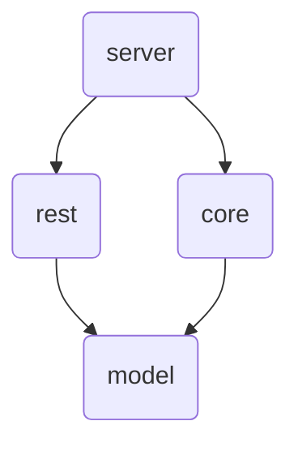

# goworker
A simple background worker for data orchestration and task handling in golang.

## Architecture
```
.
├── cmd/
│   └── /server/
│       └── main.go
├── internal/
│   ├── core/
│   └── rest/
│   ├── model/
├── go.mod
└── go.sum
```

The cmd folder holds the server main.go file. This file will only import internal and will not import any other files.

The `interal/core` folder holds tasks, routines, and sensors. These will import the models in `internal/core` .

The `interal/rest` folder holds the handler methods for any http functionality and any data local to those operations. They will import `internal/model` .

The `internal/model` folder holds the data representation types and structures. these will be imported by everything else, and have no external dependencies. There should be *one model per file*.

`internal/core` and `internal/rest` import `internal/model` , which will not import anything else.

This can be visualized as a series of progressively deeper layers:



This avoids any potential for cyclic dependencies and orients the api around the domain data.

This data should be defined first, and then the corresponding functionality should be created to manipulate that data.

## Use
To build, do `go build ./cmd/server` . This will produce a binary called `server` .

